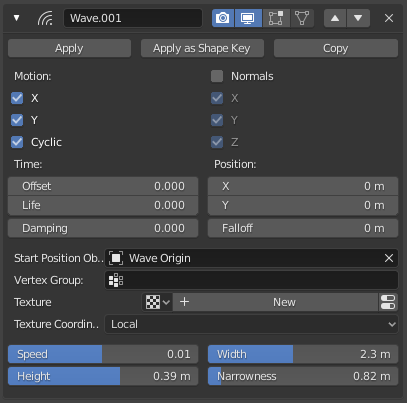
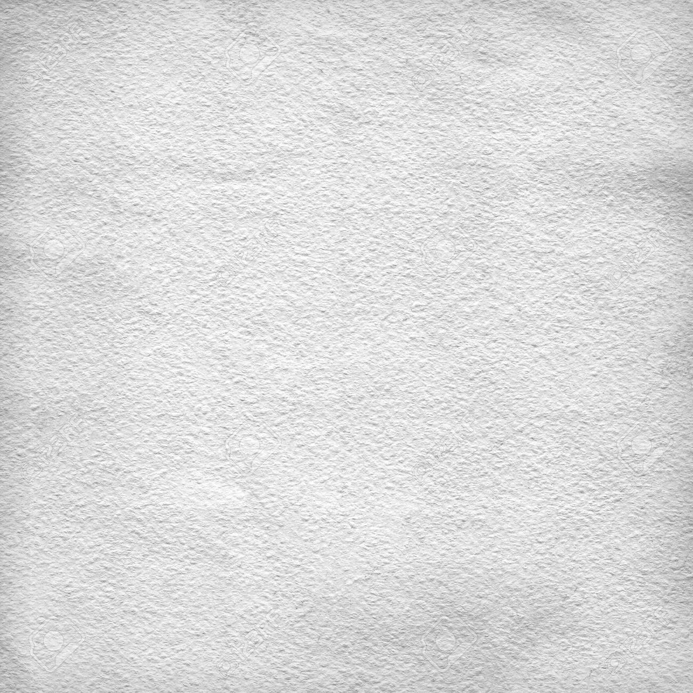
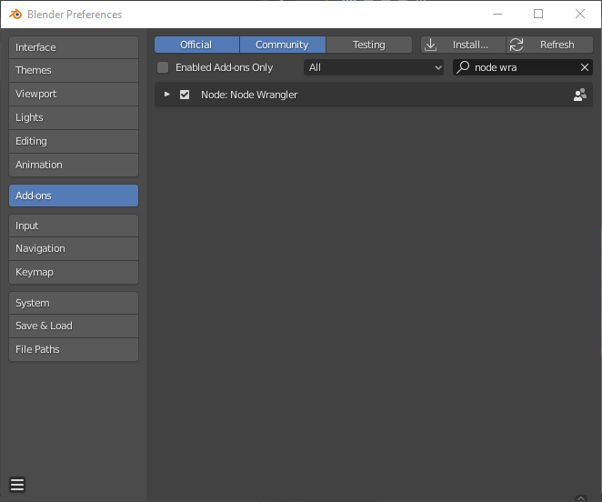
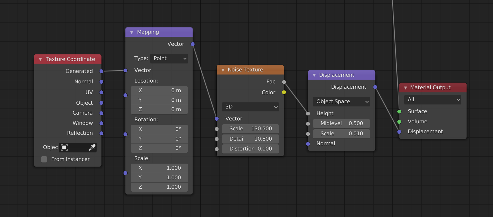
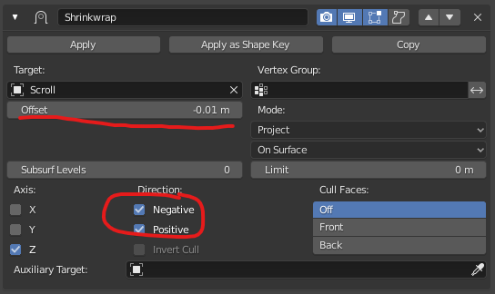

# 📃Glyphed Pages

How to create your own glyphed pages in [Blender](https://www.blender.org/download/releases/2-81/).

## 📃Page

1. Desecrate the Default Cube; Add a Plane
2. and we shall name it **"Scroll"**
3. (because when you give birth to something, it should have a name)
4. Scale 5; Subdivide (100); now Shade it Smooth   

Now let's make it move.

## 🌊 Get Wavy

1. Add a Wave Modifier - Modifier Properties > Add Modifier > Wave
2. Add an Empty named **"Wave Origin"** and then the **Start Position** to it
3. Move **Start Position** wherever you like.

   - **Speed**: 0.01
   - **Height**: .39
   - **Width** 2.3
   - **Narrowness** 0.82

### 🕶 Shade

0. Get a Reference
   - 

Paper has bumpies.
 
1. Go to Shading
2. Create a material, name it **"Paper"**
3. Noise Displacement
   1. Add Noise: Shift+A, S, "Noise", Enter
   2. Add Displacement: Shift+A, S, "Dis", Enter
4. Ctrl+T on Noise Texture
   1. Enable the Node Wrangler Add-on: 

**Noise Texture** 
- **Scale** `32.0`
- **Detail** `2.0`

**Displacement**
- **Scale**, a very small `0.01`. Small bumpies.

## Glyphs

1. Shift+A, Text name it **"Title"**
3. Horizontal Center
4. Add Shrinkwrap Modifier
   -  
   -  **Offset** -0.01 m
   -  ✅ **Negative**
   -  ✅ **Positive**

### Shade

1. New Material named **"Glyph"**
2. Delete Principled
3. Add Emission Shader

### Wave Displacement

### Lighting

Set light to **#FFE9A8**

### Render Settings 

1. ✅ Bloom